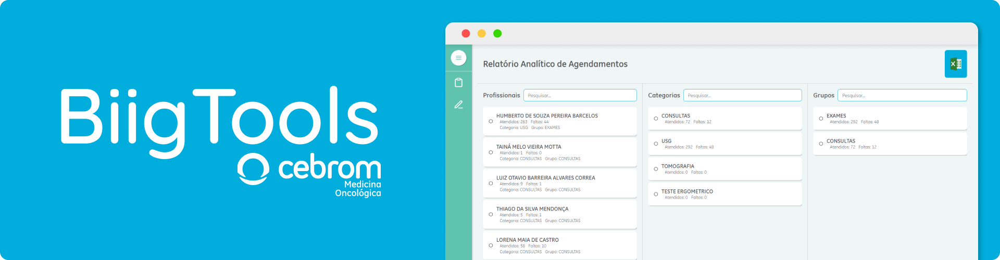
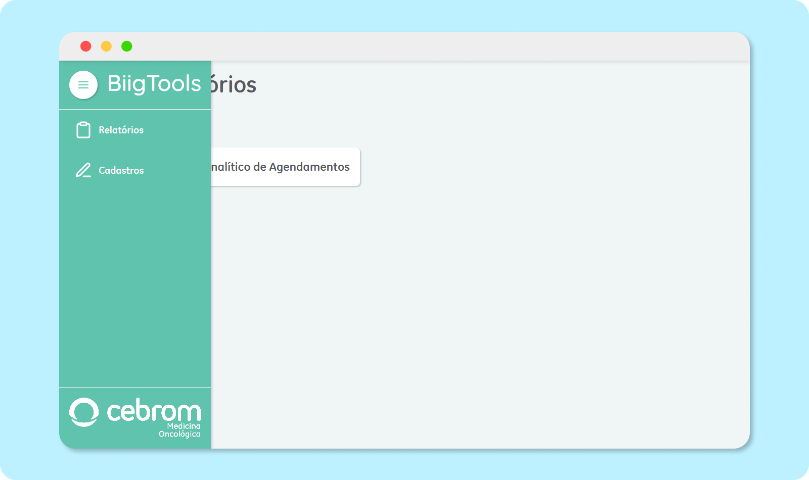
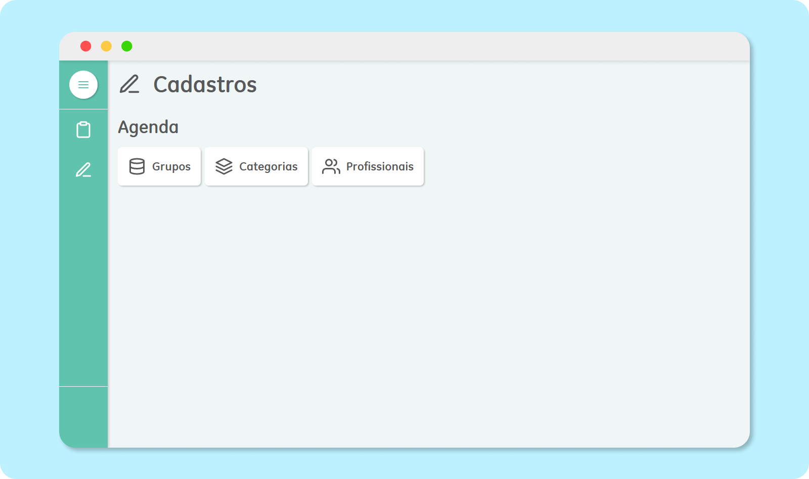
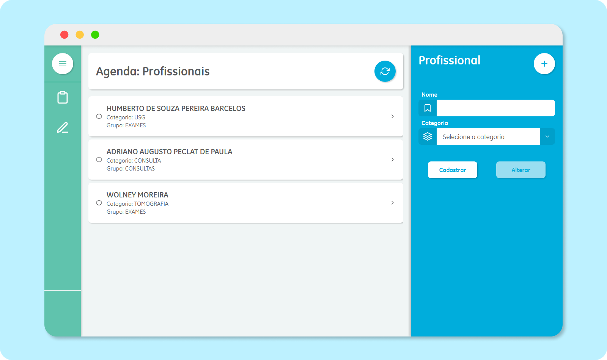
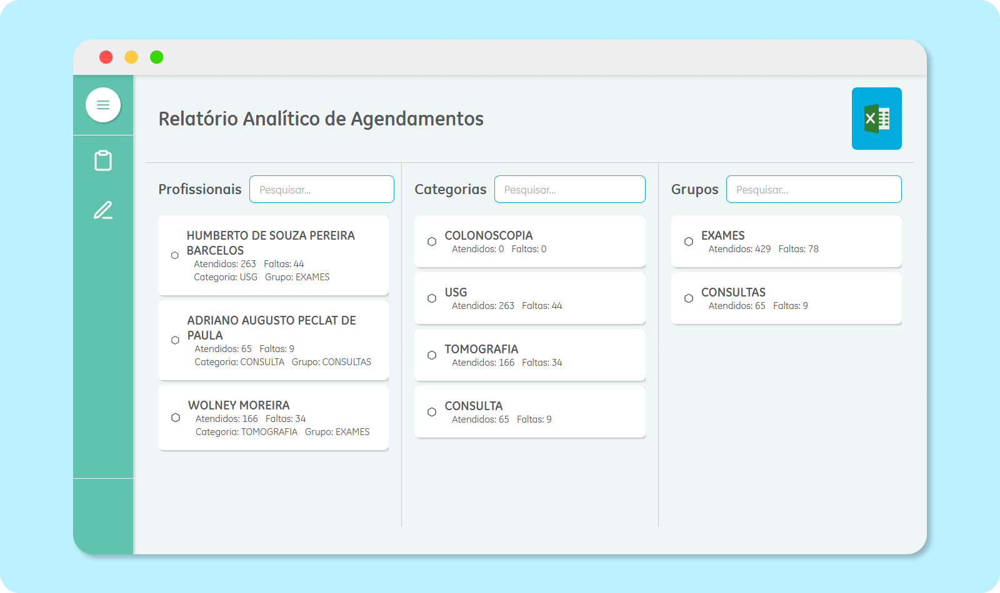

<p align="center">
 
</p>

<h3 align="center">BiigTools</h3>

---

Aplicação desenvolvida para processar dados de relatórios gerados em planilhas de Excel geradas pela aplicação [Portalmedic](https://portalmedic.onitecnologia.com.br/).


## 📝 Conteúdo

- [Sobre](#about)
- [Funcionalidades](#tools)
- [Instalação](#install)
- [Tecnologias utilizadas](#built_using)
- [Autores](#authors)
- [Screenshots](#screenshots)

## 🧐 Sobre <a name = "about"></a>

A aplicação tem como intuito de melhorar os relatórios gerados na ferramenta [Portalmedic](https://portalmedic.onitecnologia.com.br/) para apresentar os dados de acordo com a necessidade do CEBROM para preencher o ``Boletim de Informações e Indicadores Gerenciais (BIIG)``.<br /><br />

## 🔧 Funcionalidades <a name = "tools"></a>

- `Cadastro de grupos da agenda`
- `Cadastro de categorias`
- `Cadastro de profissionais`
- `Relatório da agenda contabilizando atendimentos e faltas`

## 🏁 Instalação <a name = "install"></a>

Faça o download do projeto em .zip ou utilize git caso esteja instalado na máquina:

```
git clone https://github.com/agustinhopneto/biigtools.git
```

Abra a pasta `server`, copie o arquivo `.env.example` e renomeie a cópia para `.env`, abra o arquivo copiado e edite as informações de ambiente.

Depois entre na pasta do projeto pelo terminal e execute:

```
cd server
npm install
```

Execute as migrations do banco de dados:

```
npm run migrate
```

Depoins inicie o back-end:

```
npm run start
```

Volte na pasta raiz do projeto e execute:

```
cd web
npm install
```

Abra a pasta `web`, copie o arquivo `.env.example` e renomeie a cópia para `.env`, abra o arquivo copiado e edite as informações de ambiente.

Depoins inicie o front-end:

```
npm run start
```

### Pré-requisitos

Para rodar o projeto é importante que tenha o [Node.js](nodejs.org) instalado na sua versão mais recente ou maior que `12.18.1`.

É necessário também ter o [PostgreSQL](https://www.postgresql.org/) pelo menos na versão `7.2`. 

## ⛏️ Feito utilizando <a name = "built_using"></a>

- [NodeJs](https://nodejs.org/en/)
- [ReactJS](https://pt-br.reactjs.org/)
- [Typescript](https://www.typescriptlang.org/)
- [EsLint](https://eslint.org/)
- [Prettier](https://prettier.io/)
- [ExpressJS](https://expressjs.com/pt-br/)
- [ExcelJS](https://github.com/exceljs/exceljs)
- [Multer](https://www.npmjs.com/package/multer)
- [KnexJS](http://knexjs.org/)
- [React Spring](https://www.react-spring.io/)
- [Yup](https://github.com/jquense/yup)
- [Styled Components](https://styled-components.com/)

## 💻 Screenshots <a name = "screenshots"></a>

<p align="center">
 
</p>
<p align="center">
 
</p>
<p align="center">
 
</p>
<p align="center">
 
</p>


## ✍️ Autor <a name = "authors"></a>

- [@agustinhopneto](https://linkedin.com/in/agustinhopneto) - Design e Desenvolvimento

